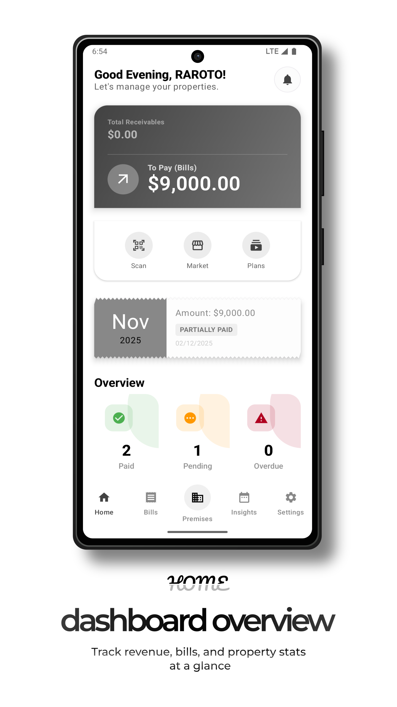
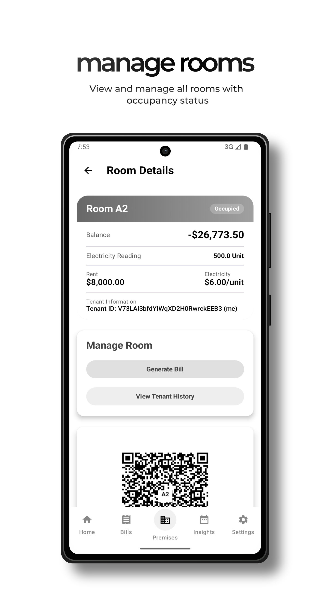
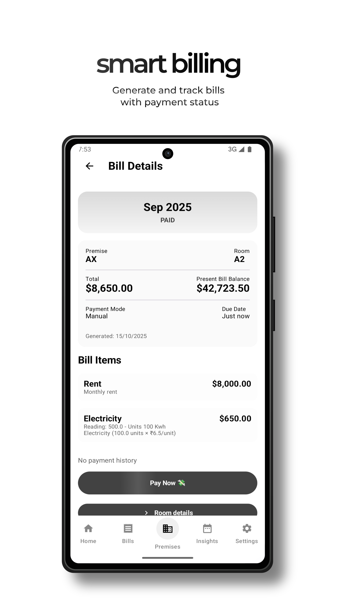
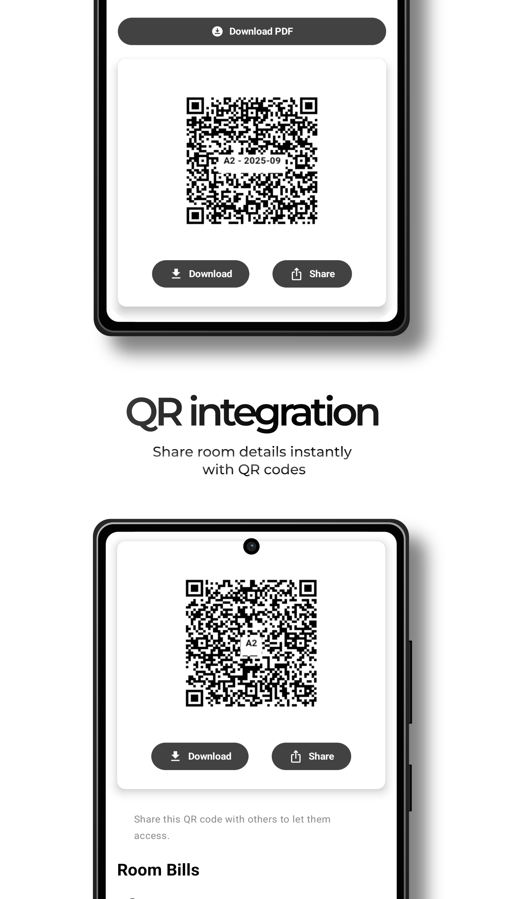
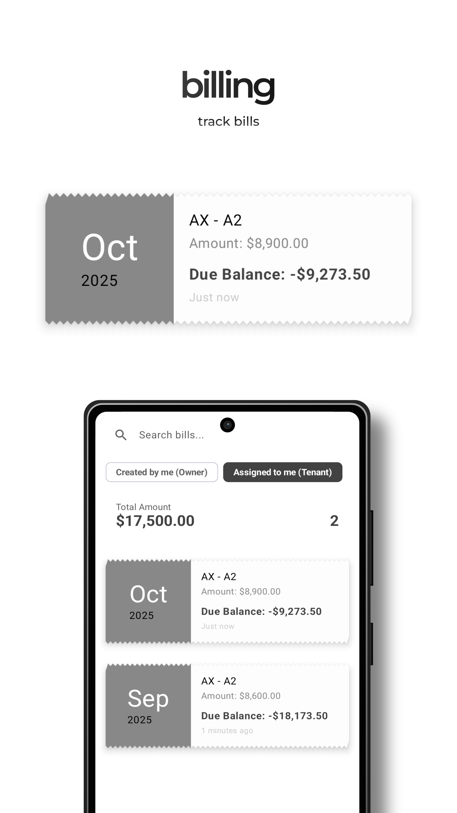

# Home 2 Tenant Manangement (Kotlin Jetpack compoase)

An android application to manage tenant.

---

## 🚀 Features
- Property & tenant management system
- Multi-account support
- Built with Kotlin, Jetpack Compose, Room, Firebase

---

## 🛠 Tech Stack
- Kotlin
- Jetpack Compose
- Firebase
- Room

---

## 📸 Screenshots





---

## ⚙️ How to Use
```bash
https://pnrt.github.io/home-2-public-assets/image_name.png
```

## Download the App
https://play.google.com/store/apps/details?id=com.pankajkumarrout.home2

## 📌 Future Improvements

- Add AI API integration
- Cloud scheduling

## 👤 Author

Pankaj Kumar Rout

## Why This Project Matters
This project demonstrates:
- Timeply bill Generation
- Multi user system
- Advanced notification
- Easy analytics

